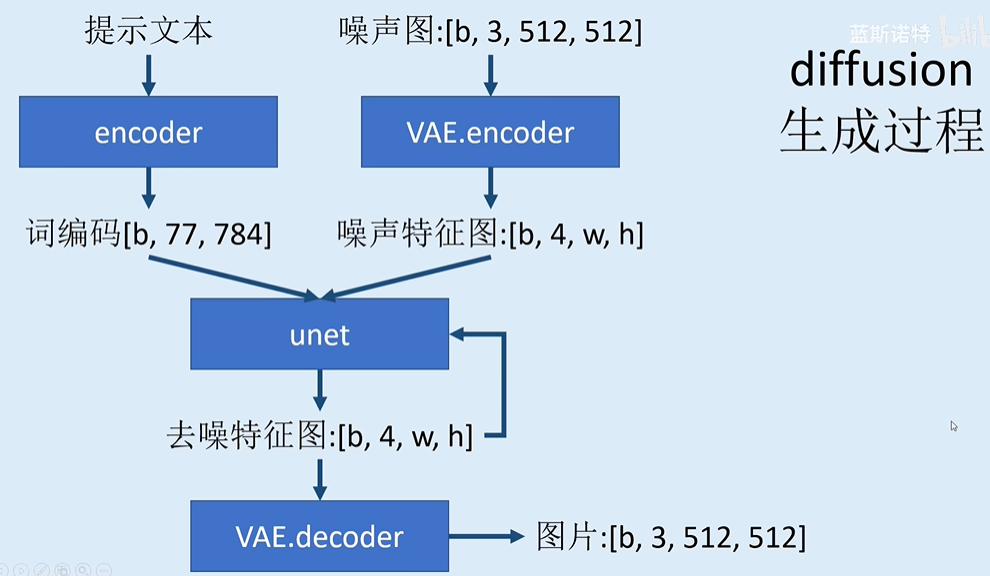
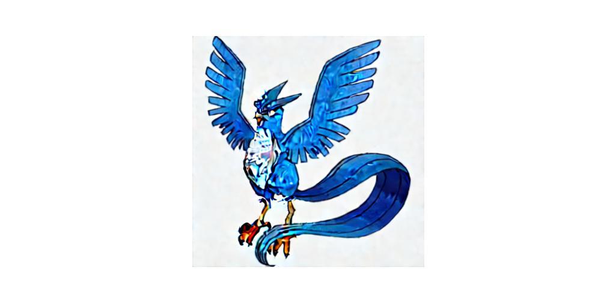
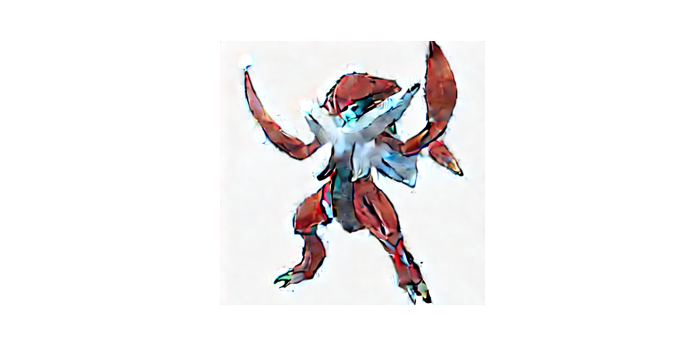

# 说明
* 功能：利用diffusion实现pokenmon风格文生图
* 模型框架：

# 项目文件
* model:模型定义
  * text_encoder.py:文本编码器
  * vae.py:图像编码器及解码器
  * unet.py:去噪模型
* LoadPretrained.py:加载预训练模型的参数
* train.py:训练程序
* inference.py:推理程序

# 使用
1. 安装相关运行环境
2. 执行train.py进行模型训练
3. 也可直接执行inference.py加载训练好的模型进行推理

# 效果
输入:a blue and white bird with its wings spread
 
输出:

 
输入:A man in red with a sword
 
输出:

# 运行环境:
python==3.9
 
pytorch==1.12.1+cu113
 
transformers==4.26.1
 
datasets==2.9.0
 
diffusers==0.12.1

# 参考
https://github.com/lansinuote/Diffusion_From_Scratch